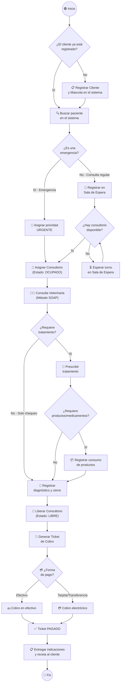
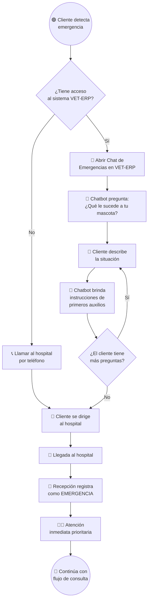
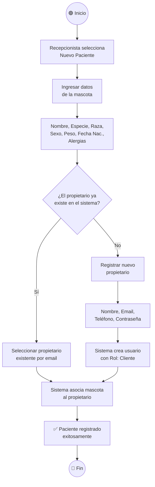
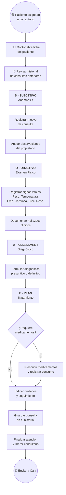
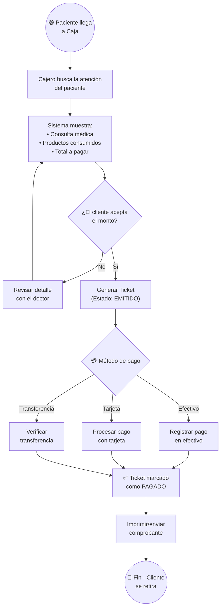
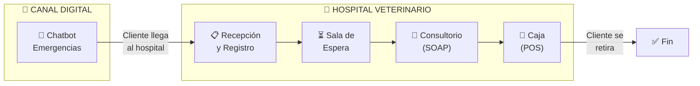

# Diagrama de Actividad — Modelo de Negocio del Hospital Veterinario

## 1. Flujo Principal del Negocio (Vista General)

Este diagrama muestra el proceso completo desde que un cliente llega al hospital con su mascota hasta que se retira con el tratamiento.

---

## 2. Flujo de Emergencias con Chatbot (Nuevo Módulo)

Este diagrama muestra cómo el chatbot de IA asiste al cliente ANTES de llegar al hospital.

---

## 3. Detalle: Proceso de Registro de Paciente

---

## 4. Detalle: Proceso de Atención Clínica (Método SOAP)

---

## 5. Detalle: Proceso de Caja / POS

---

## 6. Actores del Sistema

| Actor | Rol | Acciones principales |
|---|---|---|
| **Recepcionista** | Registro y gestión de turnos | Registrar pacientes, gestionar sala de espera, asignar consultorios |
| **Veterinario** | Atención clínica | Realizar consultas (SOAP), diagnosticar, prescribir tratamiento |
| **Cajero** | Facturación y cobro | Generar tickets, cobrar, anular tickets |
| **Administrador** | Gestión integral | Acceso completo al sistema, reportes financieros, gestión de usuarios |
| **Cliente/Propietario** | Dueño de la mascota | Consultar chatbot de emergencias, ver historial de su mascota |
| **Chatbot (IA)** | Asistente virtual | Orientar en emergencias veterinarias con primeros auxilios |

---

## 7. Resumen del Modelo de Negocio

