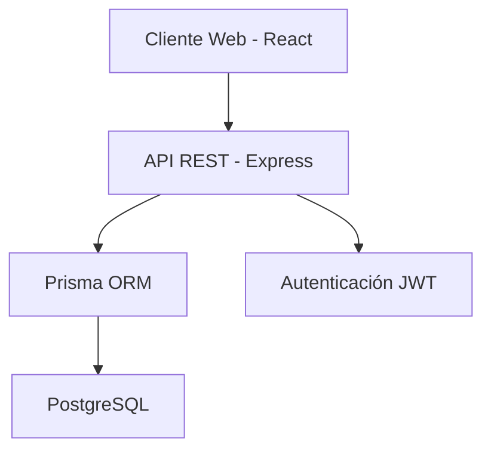

# Especificación Técnica: Sistema Veterinario Integral

## 1. Resumen Ejecutivo

Sistema web integral para la gestión de un hospital veterinario que integra consultas médicas, inventario, caja, laboratorio y contabilidad. Desarrollado como proyecto de grado utilizando tecnologías modernas (Node.js, React, PostgreSQL).

---

## 2. Objetivos del Sistema

### 2.1 Objetivo General
Desarrollar un sistema web que automatice y centralice los procesos operativos de un hospital veterinario, mejorando la eficiencia en la atención de pacientes y el control administrativo.

### 2.2 Objetivos Específicos
- Gestionar historias clínicas digitales de mascotas con trazabilidad completa
- Automatizar el control de inventario con descuentos en tiempo real
- Integrar el flujo de caja con consultas y laboratorio
- Implementar sistema de roles con permisos diferenciados
- Generar reportes contables y estadísticos

---

## 3. Alcance del Proyecto

### 3.1 Módulos Incluidos
1. **Gestión de Usuarios y Roles** (RBAC)
2. **Consultorio y Fichaje**
3. **Historia Clínica Digital**
4. **Inventario y Farmacia**
5. **Caja y Facturación**
6. **Laboratorio Clínico**
7. **Contabilidad y Auditoría**

### 3.2 Fuera del Alcance (Versión 1.0)
- Integración con sistemas externos (SUNAT, bancos)
- Aplicación móvil nativa
- Telemedicina o consultas virtuales
- Sistema de citas en línea para clientes

---

## 4. Requerimientos Funcionales

### RF-01: Gestión de Usuarios
- **RF-01.1**: El sistema debe permitir registrar usuarios con roles específicos
- **RF-01.2**: Cada rol debe tener permisos diferenciados (Admin, Doctor, Cajero, Farmacéutico, Laboratorista)
- **RF-01.3**: Los usuarios deben autenticarse mediante email y contraseña

### RF-02: Gestión de Mascotas
- **RF-02.1**: Registrar mascotas vinculadas a un propietario
- **RF-02.2**: Almacenar datos: especie, raza, edad, alergias, peso
- **RF-02.3**: Visualizar historial completo de atenciones

### RF-03: Consultorio
- **RF-03.1**: Mostrar estado de consultorios (Libre, Ocupado, Limpieza)
- **RF-03.2**: Registrar diagnóstico, tratamiento y medicamentos usados
- **RF-03.3**: Generar automáticamente orden de cobro al finalizar consulta

### RF-04: Inventario
- **RF-04.1**: Registrar productos con stock actual y mínimo
- **RF-04.2**: Descontar automáticamente insumos usados en consultas
- **RF-04.3**: Alertar cuando el stock esté por debajo del mínimo

### RF-05: Caja
- **RF-05.1**: Consolidar cargos de consulta, farmacia y laboratorio
- **RF-05.2**: Registrar método de pago (Efectivo, Tarjeta, Transferencia)
- **RF-05.3**: Solo administradores pueden anular tickets

### RF-06: Laboratorio
- **RF-06.1**: Registrar órdenes de exámenes solicitadas por doctores
- **RF-06.2**: Cargar resultados de análisis
- **RF-06.3**: Integrar resultados en la historia clínica

### RF-07: Contabilidad
- **RF-07.1**: Generar reportes de ingresos diarios/mensuales
- **RF-07.2**: Auditar anulaciones de tickets
- **RF-07.3**: Exportar datos a Excel

---

## 5. Requerimientos No Funcionales

### RNF-01: Rendimiento
- Tiempo de respuesta < 2 segundos para operaciones CRUD
- Soporte para 50 usuarios concurrentes

### RNF-02: Seguridad
- Contraseñas encriptadas con bcrypt
- Autenticación mediante JWT
- Validación de permisos en cada endpoint

### RNF-03: Usabilidad
- Interfaz intuitiva con modo oscuro
- Diseño responsive (Desktop y Tablet)
- Mensajes de error claros

### RNF-04: Mantenibilidad
- Código documentado
- Arquitectura en capas (MVC)
- Uso de TypeScript para tipado estático

---

## 6. Arquitectura del Sistema

### 6.1 Arquitectura General

### 6.2 Stack Tecnológico

#### Backend
- **Lenguaje**: TypeScript
- **Framework**: Node.js + Express
- **ORM**: Prisma 7
- **Base de Datos**: PostgreSQL 16

#### Frontend
- **Framework**: React 18 + Vite
- **Estilos**: Tailwind CSS
- **Enrutamiento**: React Router DOM
- **Estado Global**: Context API / Zustand

#### Herramientas
- **Linting**: Biome
- **Control de Versiones**: Git
- **Contenedores**: Docker (opcional)

---

## 7. Modelo de Datos

### 7.1 Entidades Principales
- **Role**: Roles del sistema
- **Usuario**: Empleados y clientes
- **Mascota**: Pacientes del hospital
- **Consultorio**: Salas de atención
- **Atencion**: Historia clínica
- **Producto**: Inventario de farmacia
- **ConsumoAtencion**: Insumos usados
- **TicketCaja**: Facturación
- **OrdenLaboratorio**: Exámenes clínicos

### 7.2 Relaciones Clave
- Un Usuario puede tener muchas Mascotas (1:N)
- Una Mascota tiene muchas Atenciones (1:N)
- Una Atención consume muchos Productos (N:M)
- Una Atención genera un TicketCaja (1:1)

---

## 8. Casos de Uso Principales

### CU-01: Atención Médica Completa
**Actor**: Doctor
**Flujo**:
1. Doctor abre ficha de mascota
2. Registra diagnóstico y tratamiento
3. Selecciona medicamentos/materiales usados
4. Sistema descuenta stock automáticamente
5. Sistema genera pre-factura para caja

### CU-02: Cobro en Caja
**Actor**: Cajero
**Flujo**:
1. Cajero busca atención pendiente
2. Sistema muestra desglose (consulta + materiales + lab)
3. Cajero registra método de pago
4. Sistema marca atención como "Pagada"

### CU-03: Procesamiento de Laboratorio
**Actor**: Laboratorista
**Flujo**:
1. Laboratorista ve órdenes pendientes
2. Procesa muestra y carga resultados
3. Sistema integra resultados en historia clínica
4. Sistema suma costo a cuenta en caja

---

## 9. Interfaces de Usuario

### 9.1 Pantallas Principales
1. **Login**: Autenticación de usuarios
2. **Dashboard**: KPIs y estado de consultorios
3. **Consulta Médica**: Formulario de atención
4. **Caja**: Cola de cobros
5. **Inventario**: Gestión de stock
6. **Laboratorio**: Órdenes y resultados

### 9.2 Estándares de Diseño
- **Paleta de Colores**: Verde esmeralda (salud), Azul (profesionalismo), Rojo (alertas)
- **Tipografía**: Inter o Roboto
- **Modo Oscuro**: Por defecto para reducir fatiga visual

---

## 10. Plan de Desarrollo

### Fase 1: Fundamentos (Semanas 1-2)
- Configuración de entorno
- Sistema de autenticación
- CRUD de usuarios y roles

### Fase 2: Gestión Clínica (Semanas 3-4)
- Registro de mascotas
- Historia clínica
- Fichaje de consultorios

### Fase 3: Inventario (Semana 5)
- Catálogo de productos
- Descuento automático de stock

### Fase 4: Integración (Semanas 6-7)
- Módulo de caja
- Módulo de laboratorio
- Flujo completo integrado

### Fase 5: Finalización (Semana 8)
- Reportes y estadísticas
- Pruebas de seguridad
- Documentación final

---

## 11. Riesgos y Mitigaciones

| Riesgo | Probabilidad | Impacto | Mitigación |
|--------|--------------|---------|------------|
| Pérdida de datos | Baja | Alto | Backups automáticos diarios |
| Acceso no autorizado | Media | Alto | Autenticación robusta + auditoría |
| Baja adopción por usuarios | Media | Medio | Capacitación y UI intuitiva |
| Bugs en producción | Alta | Medio | Testing exhaustivo + rollback plan |

---

## 12. Criterios de Aceptación

- [ ] Todos los módulos funcionales implementados
- [ ] Pruebas de integración exitosas
- [ ] Documentación técnica completa
- [ ] Manual de usuario elaborado
- [ ] Sistema desplegado en servidor de pruebas
- [ ] Capacitación al personal realizada

---

## 13. Glosario

- **RBAC**: Role-Based Access Control (Control de Acceso Basado en Roles)
- **CRUD**: Create, Read, Update, Delete
- **JWT**: JSON Web Token
- **ORM**: Object-Relational Mapping
- **API REST**: Representational State Transfer Application Programming Interface
