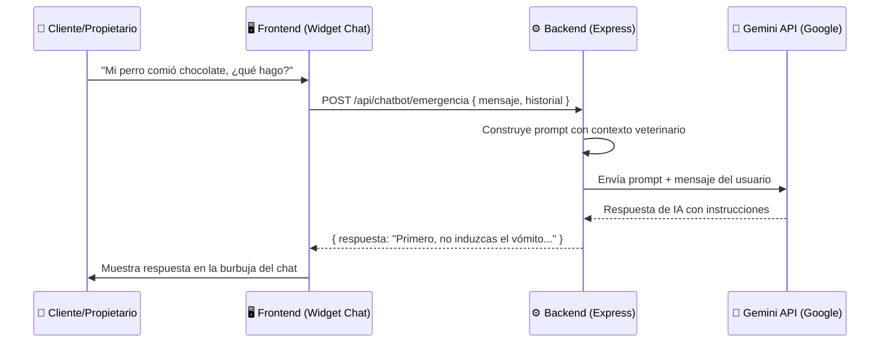
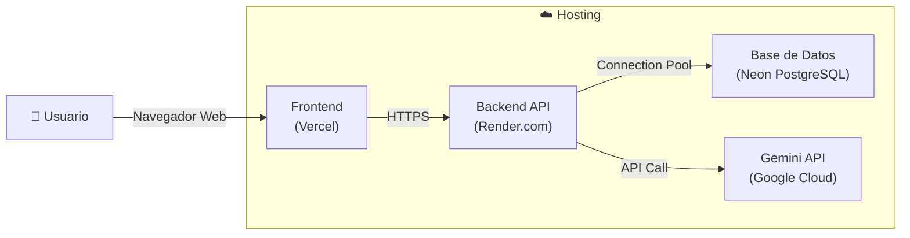
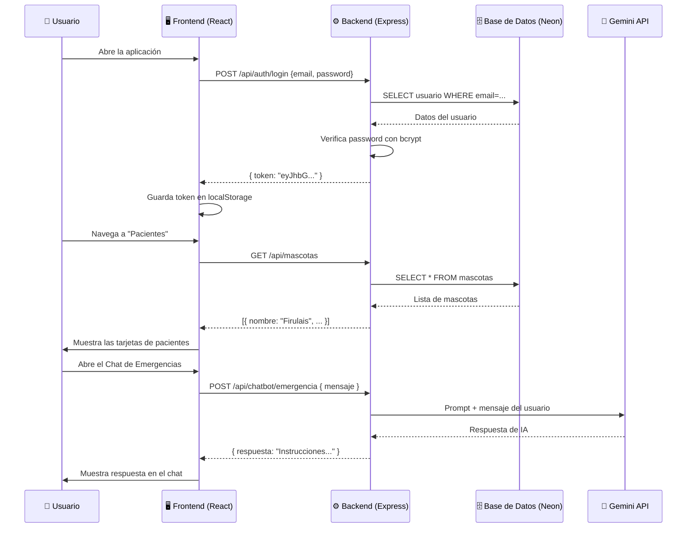
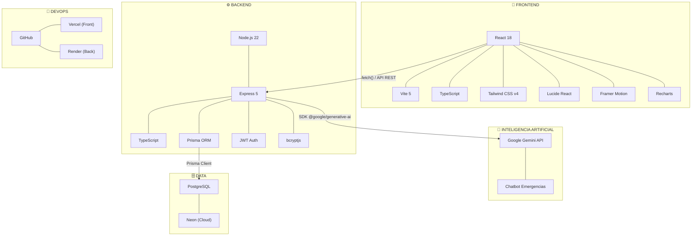

# Stack Tecnológico — Sistema Veterinario Integral (VET-ERP)

## 1. Frontend

| Tecnología | Versión | Propósito | Estado |
|---|---|---|---|
| **React** | 18.x | Librería principal para construir la interfaz de usuario con componentes reutilizables | ✅ Implementado |
| **TypeScript** | 5.9 | Superset de JavaScript que agrega tipado estático, mejora la calidad del código y previene errores | ✅ Implementado |
| **Vite** | 5.x | Bundler y servidor de desarrollo ultrarrápido (reemplazo moderno de Webpack) | ✅ Implementado |
| **Tailwind CSS** | v4 | Framework de utilidades CSS para diseño rápido y responsivo | ✅ Implementado |
| **Lucide React** | — | Librería de iconos SVG ligeros y consistentes | ✅ Implementado |
| **Motion (Framer)** | — | Animaciones y transiciones fluidas en la interfaz | ✅ Implementado |
| **Recharts** | — | Gráficos y visualización de datos en el Dashboard | ✅ Implementado |
| **date-fns** | — | Manipulación y formateo de fechas | ✅ Implementado |

> [!TIP]
> **¿Por qué React + Vite y no Next.js?**
> Para este proyecto tipo ERP/SPA (Single Page Application) donde toda la navegación es interna (Dashboard → Pacientes → Caja), no necesitamos SSR (Server-Side Rendering) ni rutas de páginas. React + Vite nos da la velocidad de desarrollo sin complejidad innecesaria.

---

## 2. Backend

| Tecnología | Versión | Propósito | Estado |
|---|---|---|---|
| **Node.js** | 22.x | Entorno de ejecución de JavaScript en el servidor | ✅ Implementado |
| **Express** | 5.x | Framework web minimalista para crear la API REST | ✅ Implementado |
| **TypeScript** | 5.9 | Tipado estático también en el servidor | ✅ Implementado |
| **Prisma ORM** | 6.x | ORM moderno que genera tipos automáticos desde el esquema de la BD, maneja migraciones y consultas de forma segura | ✅ Implementado |
| **bcryptjs** | 3.x | Hashing seguro de contraseñas (algoritmo bcrypt) | ✅ Implementado |
| **jsonwebtoken (JWT)** | 9.x | Generación y verificación de tokens de autenticación | ✅ Implementado |
| **cors** | 2.x | Middleware para permitir peticiones cross-origin entre frontend y backend | ✅ Implementado |
| **dotenv** | 17.x | Carga de variables de entorno desde archivos `.env` | ✅ Implementado |

> [!NOTE]
> **Patrón de arquitectura del backend:** Usamos una arquitectura en **3 capas** (Layered Architecture) — **ya implementada al 100%:**
> - **Routes** → Define los endpoints HTTP (`/api/mascotas`, `/api/auth/login`, etc.)
> - **Controllers** → Recibe la petición, valida y delega la lógica
> - **Services** → Contiene la lógica de negocio y las consultas a la base de datos vía Prisma

### Módulos implementados con arquitectura de 3 capas:

| Módulo | Route | Controller | Service |
|---|---|---|---|
| Autenticación | `auth.routes.ts` | `auth.controller.ts` | `auth.service.ts` |
| Mascotas | `mascotas.routes.ts` | `mascota.controller.ts` | `mascota.service.ts` |
| Atenciones Clínicas | `atenciones.routes.ts` | `atencion.controller.ts` | `atencion.service.ts` |
| Consultorios | `consultorios.routes.ts` | `consultorio.controller.ts` | `consultorio.service.ts` |
| Productos | `productos.routes.ts` | `producto.controller.ts` | `producto.service.ts` |
| Tickets/Caja | `tickets.routes.ts` | `ticket.controller.ts` | `ticket.service.ts` |

---

## 3. Base de Datos

| Tecnología | Propósito | Estado |
|---|---|---|
| **PostgreSQL** | Motor de base de datos relacional robusto y escalable | ✅ Implementado |
| **Neon** (neon.tech) | Hosting serverless de PostgreSQL en la nube | ✅ Implementado |

### 🔄 Neon vs Supabase — ¿Cuál elegir?

Ambas son excelentes opciones. Aquí la comparación honesta:

| Criterio | Neon | Supabase |
|---|---|---|
| **Base de datos** | PostgreSQL puro | PostgreSQL + extras (Auth, Storage, Realtime) |
| **Precio** | Gratis (tier generoso) | Gratis (tier generoso) |
| **Complejidad** | ✅ Mínima — solo te da la BD | Más herramientas = más que aprender |
| **Compatibilidad con Prisma** | ✅ Perfecta, sin configuración extra | ✅ Funciona, pero hay pasos adicionales de config |
| **Ideal para** | Proyectos donde ya tienes tu propio backend (como el nuestro) | Proyectos donde NO quieres hacer backend propio |
| **Para tu tesis** | ⭐ **Recomendado** — demuestra que TÚ construiste el backend | Puede dar la impresión de que "Supabase hizo el trabajo" |

> [!IMPORTANT]
> **Decisión tomada:** Usamos **Neon**. Ya está configurado y funcionando. Para el proyecto de grado, demuestra que el backend fue construido manualmente con Express + Prisma, lo que fortalece la defensa académica.

---

## 4. Inteligencia Artificial — Chatbot de Emergencias 🚨

| Tecnología | Versión | Propósito | Estado |
|---|---|---|---|
| **Google Gemini API** | — | Motor de IA generativa para el chatbot conversacional de emergencias veterinarias | 🔜 Por implementar |
| **@google/generative-ai** | — | SDK oficial de Google para integrar Gemini en Node.js | 🔜 Por implementar |

### Descripción funcional del Chatbot

El sistema incluirá un **asistente virtual de emergencias veterinarias** que orientará a los propietarios de mascotas sobre **primeros auxilios** mientras se dirigen al hospital. El chatbot:

- Responderá consultas sobre situaciones de emergencia (envenenamiento, fracturas, convulsiones, golpes de calor, etc.)
- Proporcionará instrucciones paso a paso de primeros auxilios adaptados a la especie de la mascota
- **Siempre** recomendará acudir al hospital veterinario lo antes posible
- NO emitirá diagnósticos médicos, solo orientación de primeros auxilios

### Arquitectura del Chatbot

> [!NOTE]
> **Limitaciones intencionales del chatbot:**
> El prompt del sistema estará configurado para que el chatbot SOLO responda sobre emergencias veterinarias y primeros auxilios. Si el usuario pregunta algo no relacionado, responderá educadamente que solo puede ayudar con emergencias de mascotas.

---

## 5. Otras Tecnologías Complementarias

| Tecnología | Propósito | Estado |
|---|---|---|
| **Git + GitHub** | Control de versiones y repositorio remoto ([ERP-HVeterinaria](https://github.com/RimbertyRamos/ERP-HVeterinaria)) | ✅ Implementado |
| **Prisma Studio** | Herramienta visual para inspeccionar y editar datos directamente en la BD | ✅ Implementado |
| **Nodemon** | Reinicio automático del servidor en desarrollo al detectar cambios | ✅ Implementado |
| **ts-node** | Ejecutar TypeScript directamente sin compilar a JS manualmente | ✅ Implementado |

---

## 6. DevOps (Despliegue y Operaciones)

Para cuando llegue el momento de desplegar el proyecto, esta es la arquitectura recomendada:

| Componente | Servicio Recomendado | Costo | Justificación |
|---|---|---|---|
| **Frontend** | **Vercel** | Gratis | Despliegue automático desde GitHub, CDN global, preview por cada PR |
| **Backend** | **Render.com** | Gratis | Soporte nativo para Node.js, auto-deploy desde GitHub, HTTPS gratis |
| **Base de Datos** | **Neon** | Gratis | Ya configurado, serverless, escala automáticamente |
| **IA / Chatbot** | **Gemini API** | Gratis (tier básico) | 15 requests/min gratis, suficiente para demo y presentación |

> [!TIP]
> **Flujo de despliegue simplificado:**
> 1. Haces `git push` a GitHub
> 2. Vercel detecta el cambio y re-despliega el frontend automáticamente
> 3. Render detecta el cambio y re-despliega el backend automáticamente
> 4. La BD en Neon siempre está disponible, no necesita despliegue
> 5. La Gemini API se consume por llamada, no requiere despliegue

---

## 7. Arquitectura de Integración (Frontend ↔ Backend ↔ IA)

Usamos una arquitectura **Cliente-Servidor con API REST**:

### Detalles técnicos de la integración:

| Aspecto | Implementación |
|---|---|
| **Protocolo** | HTTP/HTTPS con formato JSON |
| **Patrón** | API REST (GET, POST, PUT, DELETE) |
| **Autenticación** | JWT (JSON Web Tokens) — el frontend envía el token en cada petición |
| **CORS** | Configurado para permitir peticiones cross-origin entre frontend y backend |
| **Cliente HTTP** | `fetch()` nativo del navegador, centralizado en `frontend/src/utils/api.ts` |
| **IA** | Gemini API consumida desde el backend para mantener la API Key segura |
| **Puerto Backend** | `4000` (desarrollo) |
| **Puerto Frontend** | `5173` (Vite dev server) |

### Estructura completa de endpoints de la API:

| Método | Ruta | Acción | Estado |
|---|---|---|---|
| `POST` | `/api/auth/login` | Iniciar sesión | ✅ |
| `POST` | `/api/auth/register` | Registrar usuario | ✅ |
| `GET` | `/api/mascotas` | Listar pacientes | ✅ |
| `POST` | `/api/mascotas` | Crear mascota + propietario | ✅ |
| `GET` | `/api/mascotas/:id` | Detalle de un paciente | ✅ |
| `PUT` | `/api/mascotas/:id` | Actualizar mascota | ✅ |
| `DELETE` | `/api/mascotas/:id` | Eliminar mascota | ✅ |
| `POST` | `/api/atenciones` | Crear consulta clínica | ✅ |
| `GET` | `/api/atenciones` | Listar consultas | ✅ |
| `GET` | `/api/atenciones/:id` | Detalle de consulta | ✅ |
| `PUT` | `/api/atenciones/:id/finalizar` | Finalizar consulta | ✅ |
| `GET` | `/api/consultorios` | Listar consultorios | ✅ |
| `POST` | `/api/consultorios` | Crear consultorio | ✅ |
| `GET` | `/api/productos` | Listar productos | ✅ |
| `POST` | `/api/productos` | Crear producto | ✅ |
| `POST` | `/api/tickets` | Crear ticket de cobro | ✅ |
| `PUT` | `/api/tickets/:id/pagar` | Marcar ticket como pagado | ✅ |
| `PUT` | `/api/tickets/:id/anular` | Anular ticket | ✅ |
| `POST` | `/api/chatbot/emergencia` | Consulta al chatbot de emergencias | 🔜 |

---

## Resumen Visual del Stack Completo

