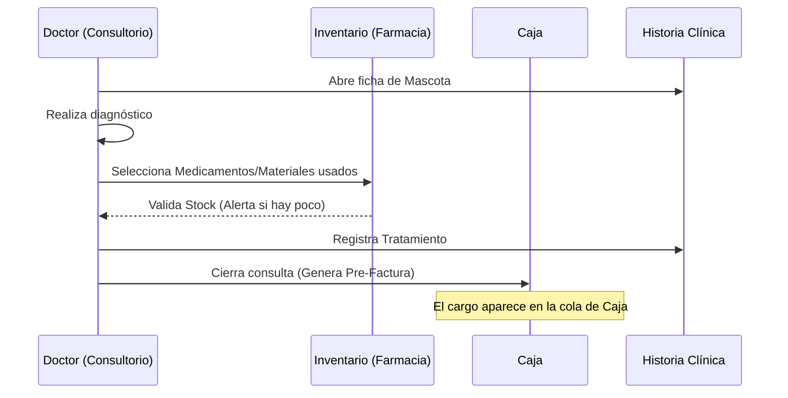

# Flujos de Trabajo: Sistema Veterinario Integral

Este documento describe cómo interactúan los usuarios con el sistema en los procesos más críticos.

## 1. Flujo de Consulta Médica e Integración
Este es el corazón del sistema, donde el Doctor interactúa con Inventario y Caja de forma automática.

## 2. Flujo de Caja y Cobro
El cajero no debe ingresar datos manualmente, todo debe venir de Consultorio o Laboratorio.

1.  **Recepción**: El dueño de la mascota se acerca a caja.
2.  **Identificación**: El cajero busca la atención pendiente por nombre de mascota o dueño.
3.  **Consolidación**: El sistema suma: `Costo Consulta` + `Materiales Usados` + `Análisis de Laboratorio`.
4.  **Pago**: Se registra el método (Efectivo, Tarjeta, Transferencia).
5.  **Cierre**: El sistema marca la atención como "Pagada" y libera el estado del consultorio.

## 3. Flujo de Laboratorio
1.  **Pedido**: El doctor solicita un examen desde la consulta.
2.  **Notificación**: Aparece en el panel del Laboratorista.
3.  **Procesamiento**: El laboratorista toma la muestra y la procesa.
4.  **Resultado**: Se cargan los valores en el sistema.
5.  **Impacto**: 
    *   El resultado aparece inmediatamente en la Historia Clínica.
    *   El costo se suma a la cuenta pendiente en Caja.

---

## 4. Gestión de Contingencias (Anulaciones)
*   Si el Cajero comete un error, el sistema **no permite borrar**.
*   El administrador debe ingresar sus credenciales para **Anular** y dejar un **Motivo**.
*   Se genera un registro de auditoría (Log) para la contabilidad.
